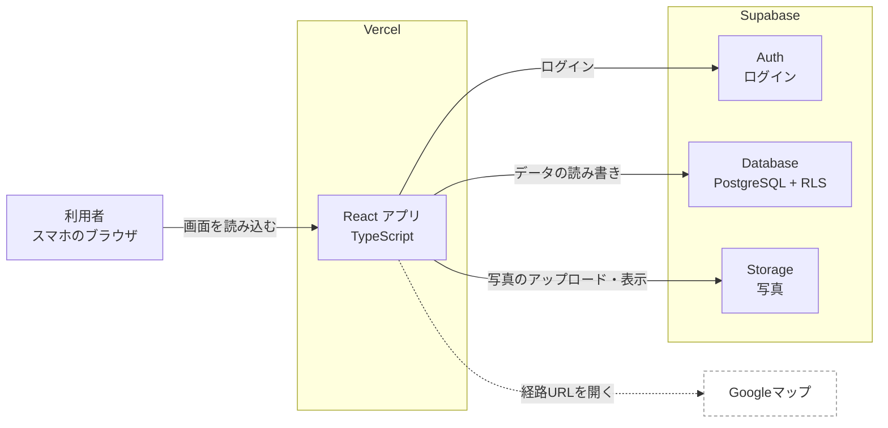
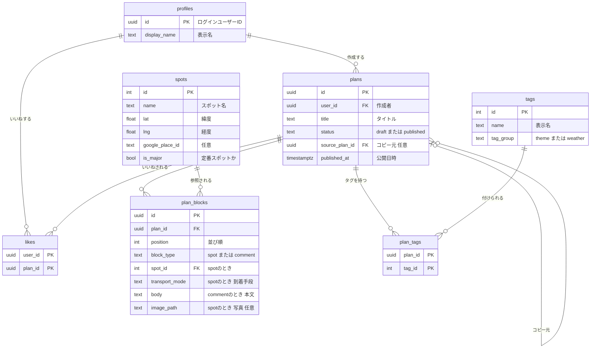

# 技術選定_API設計_v3

# 旅ノートサイト 技術選定・API設計 v3

チーム CCCA305A-1 / 対象範囲：MVP（「機能要件_画面遷移_MVP.md」の機能ID・画面IDを使用）

v2の確認事項への回答と、UIデザインのルールを反映した版。残りの確認事項は「11. 確認事項・未確定事項」にまとめている。

## 0. 変更履歴

### v2 → v3

| 項目 | 変更内容 | 根拠 |
| --- | --- | --- |
| アイコン | 絵文字を使わず、Lucide（lucide-react）のアイコンに統一。対応表を追加（9.2） | 追加要望 |
| カードのデザイン | 左側だけに太い線を引くアクセントカード（border-left）を禁止。代わりのデザインを定義（9.3） | 追加要望 |
| UIデザインルール | 新しく9章を追加。AIに守らせるため CLAUDE.md に書く内容も記載（9.5） | 追加要望 |
| タグ | アイコンと対応させるため、tags テーブルに slug 列を追加（3.2） | 9.2 |
| 3.3 の表 | 絵文字をアイコン名に置き換え | 追加要望 |
| パスワード忘れ | チームに連絡してもらい、DB担当が再設定する方式で確定（6章） | Q18 |
| GitHub | リポジトリは公開で進める。公開に伴う注意点を追記（2.1） | Q19 |
| 効果検証 | 検証段階でGoogleフォームを別に作る。サイトの設計には含めない | Q20 |
| 章番号 | 9章（UIデザインルール）の追加に伴い、旧9〜11章を10〜12章に変更 |  |

### v1 → v2

| 項目 | 変更内容 | 根拠 |
| --- | --- | --- |
| 言語 | JavaScript から TypeScript に変更。型定義を追加（5.6） | Q1、Q2 |
| 対象端末 | スマホを主にする。非機能要件を追加（8章） | Q3 |
| マイページ | 「自分のプラン（公開済み・下書き）」と「いいねしたプラン」の2つのタブにした | Q4 |
| 利用後アンケート | サイトから削除。F-33、survey_responses テーブル、submitSurvey を削除 | Q5 |
| 公開済みプラン | 編集と非公開化を可能にした。`unpublishPlan` を追加 | Q8 |
| 制限値 | ブロック30個まで、ランキングは全期間、公開時のチェック条件を確定 | Q6、Q9、Q10 |
| ログイン | メールアドレスとパスワードのみ。メールは一切送信しない。パスワード再設定の扱いを追加（6章） | Q15 |
| Vercel | 自動公開の仕組みと注意点を追記（2.1） | Q16 |

## 1. 技術選定

### 1.1 結論

| 区分 | 採用 | 備考 |
| --- | --- | --- |
| 言語 | TypeScript | データの形を型で決め、3人とAIの認識を揃える |
| フレームワーク | React + Vite | 理由は 1.2 |
| 画面の切り替え | React Router | 画面IDとURLを対応させる |
| スタイル | CSS Modules | Viteに標準で入っている。理由は 1.3 |
| ブロックの並べ替え | dnd-kit | スマホのタッチ操作に対応したドラッグ用ライブラリ |
| アイコン | Lucide（lucide-react） | 線の太さと形が揃ったアイコン集。使うものだけが読み込まれるので軽い。絵文字は使わない（9章） |
| データベース・認証・画像保存 | Supabase（Database、Auth、Storage） | 独自のサーバーは作らない |
| 公開 | Vercel | GitHubと連携し、main に取り込むと自動で公開 |
| コードの整形・チェック | Prettier、ESLint | 3人の書き方を揃えるため |
| 経路表示 | Googleマップ（URLを開くだけ） | APIキー不要 |

### 1.2 フレームワークの比較

| 候補 | 向いている点 | 今回の懸念 | 判定 |
| --- | --- | --- | --- |
| React + Vite | 部品（コンポーネント）単位で作れるのでブロックと相性が良い。AIが生成するコードの質が最も安定している。Vercelに置くだけで動く | 特になし | 採用 |
| Next.js | Vercelの開発元が作っている。検索エンジン対策や、サーバー側の処理を書ける | サーバー側とブラウザ側でコードの書き方が分かれ、AIが混同したコードを出しやすい。今回はSupabaseがサーバー役を担うので利点を使わない | 不採用 |
| フレームワークなし（素のJS） | 覚えることが最も少ない | ブロックの追加・並べ替えで画面を書き換える処理を自分で書く必要があり、3人で分担するとコードが崩れやすい | 不採用 |
| Vue + Vite | 書き方が直感的で学びやすい | Reactと比べて情報量とAIの生成精度で劣る | 不採用 |

### 1.3 CSS Modules を選んだ理由

普通のCSSは、別の人が同じクラス名（例：`.card`）を使うと見た目が壊れる。CSS Modulesはファイルごとにクラス名が自動で区別されるため、3人が並行して作っても衝突しない。書き方は普通のCSSと同じ。

色や余白などの共通の値は `styles/variables.css` にまとめ、全員がそれを使う。

### 1.4 独自サーバーを作らない理由

SupabaseはブラウザからデータベースへHTTPで直接アクセスできる仕組みを持っている。「誰がどのデータを読み書きできるか」はデータベース側のルール（RLS：行単位のアクセス制御）で守るため、間にサーバーを挟む必要がない。

複数の処理をまとめて行う必要があるもの（プランの保存、検索）だけ、データベース内に関数（RPC）を作って呼び出す。

### 1.5 TypeScriptの使い方

- Viteの `react-ts` テンプレートで始める。ファイルは `.ts` と `.tsx`
- `tsconfig.json` の `strict` を有効にする
- データベースの型は Supabase CLI で自動生成する（`supabase gen types typescript`）。テーブルを変えたらDB担当が生成し直してコミットする
- 画面で使う型は `src/types/models.ts` に手で書く（5.6）。3人とも必ずこの型を使う

## 2. システム構成



- Vercelは完成した画面ファイルを配るだけ。データの処理はすべてSupabaseが行う
- Googleマップとはデータのやり取りをせず、URLを作って新しいタブで開くだけ

### 2.1 開発環境

| 項目 | 方針 |
| --- | --- |
| ソースコード | 代表者の個人GitHubアカウントに公開リポジトリを1つ作り、他の2人をコラボレーターに追加する。各自ブランチで作業し、プルリクエストで main に取り込む |
| 公開 | 代表者の個人Vercelアカウントでリポジトリを連携する。main に取り込まれると本番URLに自動公開。プルリクエストごとに確認用URL（プレビュー）も自動で作られる |
| Supabase | 開発用プロジェクトを1つ作り、3人で共有する。データベースの構造を変えるのはDB担当だけ |
| データベースの構造 | 変更するSQLを `supabase/migrations/` にファイルで残し、誰がいつ何を変えたか分かるようにする |
| 秘密の値 | SupabaseのURLと公開用キーは `.env.local` に書き、GitHubには上げない。Vercelには管理画面で登録する |

Vercelについて：GitHubで共同作業できていれば、Vercelのアカウントは代表者1人でよい。リポジトリは公開で進めるため、代表者以外のコミットで自動公開が止まる問題は起きない想定（念のためT4で確認する）。

公開リポジトリで守ること

| ルール | 理由 |
| --- | --- |
| `.env.local` は `.gitignore` に入れ、絶対にコミットしない | 誰でもコードを見られるため |
| 管理者用のキー（service_role / secret key）はどこにも書かない | これが漏れるとRLSを無視して全データを操作される |
| サンプル投稿の写真は、チームで撮影したものか、利用が許可されたものだけを使う | 公開リポジトリと公開サイトの両方に載るため |
| 実在する個人のメールアドレスや名前をサンプルデータに入れない | 同上 |

公開用キー（anon key / publishable key）はもともとブラウザに渡るものなので、公開リポジトリに含まれても問題ない。ただし `.env.local` で管理する運用は変えない。

環境変数

```
VITE_SUPABASE_URL=https://xxxx.supabase.co
VITE_SUPABASE_ANON_KEY=（Supabaseの公開用キー。anon key または publishable key と表示される）
```

公開用キーはブラウザに渡ってよいもので、RLSで守られる。管理者用のキー（service_role / secret key）は絶対にフロントのコードに書かない。

## 3. データベース設計

### 3.1 ER図



### 3.2 テーブル定義

**profiles**（ユーザーの表示情報。メールアドレスとパスワードはSupabase Authが持つ）

| 列 | 型 | 制約 | 説明 |
| --- | --- | --- | --- |
| id | uuid | 主キー、auth.users を参照 | ユーザーID |
| display_name | text | 必須、20文字以内 | 表示名。プランに「〇〇さんのプラン」と出す |
| created_at | timestamptz | 既定値 now() | 登録日時 |

新規登録時にデータベースのトリガーで自動作成する。

**spots**（スポットのマスタ。開発側で登録し、利用者は追加できない）

| 列 | 型 | 制約 | 説明 |
| --- | --- | --- | --- |
| id | int | 主キー、自動採番 |  |
| name | text | 必須 | スポット名 |
| description | text | 任意 | 短い紹介文 |
| lat, lng | double precision | 必須 | 緯度・経度。経路URLに使う |
| google_place_id | text | 任意 | Googleマップの場所ID。あると経路URLで場所が正確になる |
| is_major | boolean | 必須、既定値 false | 定番スポットなら true。用途は 3.5 |
| sort_order | int | 既定値 0 | 一覧での表示順 |

**tags**（固定タグのマスタ）

| 列 | 型 | 制約 | 説明 |
| --- | --- | --- | --- |
| id | int | 主キー |  |
| slug | text | 必須、重複不可、英小文字 | プログラム上の名前。アイコンとの対応に使う（9.2） |
| name | text | 必須、重複不可 | 表示名 |
| tag_group | text | ‘theme’ または ‘weather’ | 画面でのまとまり |
| sort_order | int | 既定値 0 | 表示順 |

初期データ（確定）

| tag_group | name | slug |
| --- | --- | --- |
| theme | 食事 | food |
| theme | 景観 | scenery |
| theme | 歴史 | history |
| theme | 写真 | photo |
| theme | ゆったり | relaxed |
| theme | 時短 | quick |
| theme | コスパ | budget |
| theme | くつろぎ | cozy |
| weather | 晴れ | sunny |
| weather | 雨 | rainy |
| weather | 曇り | cloudy |

**plans**（旅行プラン）

| 列 | 型 | 制約 | 説明 |
| --- | --- | --- | --- |
| id | uuid | 主キー、自動生成 |  |
| user_id | uuid | 必須、profiles を参照 | 作成者 |
| title | text | 下書きは任意、公開時は必須。50文字以内 | タイトル |
| status | text | ‘draft’ または ‘published’ | 下書きか公開か。公開後に draft へ戻すこともできる |
| source_plan_id | uuid | 任意、plans を参照。コピー元が削除されたら空にする | コピー元のプラン。「〇〇さんのプランをもとに作成」と表示する |
| created_at, updated_at | timestamptz |  | 作成・更新日時 |
| published_at | timestamptz | 公開時に設定、非公開に戻すと空 | 公開日時。並び順に使う |

**plan_blocks**（プランを構成するブロック。1プラン30個まで）

| 列 | 型 | 制約 | 説明 |
| --- | --- | --- | --- |
| id | uuid | 主キー |  |
| plan_id | uuid | 必須、plans を参照、プラン削除時に一緒に削除 |  |
| position | int | 必須、0〜29、同じプラン内で重複不可 | 並び順 |
| block_type | text | ‘spot’ または ‘comment’ | ブロックの種類 |
| spot_id | int | spotのとき必須 | スポット |
| transport_mode | text | spotのとき。‘walk’、‘bus’、‘bicycle’、‘car’ のいずれか | このスポットへの到着手段。プランの最初のスポットは空 |
| body | text | commentのとき必須、500文字以内 | コメント本文 |
| image_path | text | 任意 | 写真のStorage上の場所（spotのみ、1ブロック1枚） |

**plan_tags**（プランとタグの対応）

| 列 | 型 | 制約 |
| --- | --- | --- |
| plan_id | uuid | 主キー（plan_id と tag_id の組）、プラン削除時に一緒に削除 |
| tag_id | int |  |

**likes**（いいね。マイページの「いいねしたプラン」もここから出す）

| 列 | 型 | 制約 |
| --- | --- | --- |
| user_id | uuid | 主キー（user_id と plan_id の組）。同じプランに2回いいねできない |
| plan_id | uuid | プラン削除時に一緒に削除 |
| created_at | timestamptz | いいねした日時。マイページでの並び順に使う |

### 3.3 移動手段ブロックの持ち方

画面上のブロックは3種類だが、データベースにはスポットとコメントの2種類だけを保存する。移動手段は「そのスポットへ何で来たか」として、到着側のスポットブロックに持たせる。

| 画面上の見え方（アイコン） | データベース上の持ち方 |
| --- | --- |
| スポット（MapPin）金沢駅 | spot（金沢駅、到着手段なし） |
| 移動手段（Bus）バス | ↑ 次のスポットの transport_mode = ‘bus’ から画面で生成 |
| スポット（MapPin）近江町市場 | spot（近江町市場、到着手段 bus） |
| コメント（MessageSquareText） | comment |
| 移動手段（Footprints）徒歩 | ↑ 次のスポットの transport_mode = ‘walk’ から画面で生成 |
| スポット（MapPin）国立工芸館 | spot（国立工芸館、到着手段 walk） |

こうする理由

- 「移動手段ブロックはスポットに連動し、単独で並べ替え・削除できない」という仕様を、データの形だけで自然に守れる
- 移動手段ブロックだけが残る、2つ続く、などの壊れたデータが生まれない

画面の表示ルール

- 2つ目以降のスポットブロックの直前に、移動手段ブロックを1つ表示する
- 間にコメントがある場合、移動手段ブロックは次のスポットの直前（コメントの後）に表示する
- スポットを追加したときの移動手段の初期値は「徒歩」

### 3.4 集計用ビュー plan_summaries

一覧・検索・ランキング・マイページで共通に使う「プランの要約」をビュー（保存された問い合わせ）として作る。

| 列 | 内容 |
| --- | --- |
| id, title, user_id, display_name, status, published_at, updated_at | プランと作成者 |
| like_count | いいね数 |
| spot_count | スポット数 |
| has_minor_spot | 定番以外のスポット（is_major = false）を1つ以上含むか |
| spot_names | スポット名の配列（カードに「金沢駅 → 近江町市場 → …」と出す用） |
| tag_ids | タグIDの配列 |
| cover_image_path | 最初の写真 |

ビューは作成者の権限で動くとRLSを素通りしてしまうため、`security_invoker = true` を付けて作る。

### 3.5 is_major（定番スポット）の役割

is_major は「そのスポットが観光客の集中している定番スポットかどうか」の印。プロジェクトの課題（観光客が一部の有名観光地に集中し、それ以外が知られていない）に対応する機能で使う。

| 使う機能 | 使い方 |
| --- | --- |
| F-04 定番以外の優先表示 | 検索結果で、is_major = false のスポットを含むプランを上位に出す |
| F-22 定番以外ランキング | is_major = false のスポットを含むプランだけでランキングを作る |

この印がないと、システムはどのスポットが定番なのか判断できず、2つの機能が作れない。どのスポットに印を付けるかは Q12 で決める。

## 4. アクセス制御（RLS）

| テーブル | 読む | 作る | 変える・消す |
| --- | --- | --- | --- |
| profiles | 誰でも | 自動（登録時のトリガー） | 本人のみ |
| spots, tags | 誰でも | 不可（管理画面から登録） | 不可 |
| plans | 公開済みは誰でも、下書きは本人のみ | ログインユーザーが自分のものとして | 本人のみ |
| plan_blocks, plan_tags | 親のプランが読めるなら | 親のプランの本人のみ | 親のプランの本人のみ |
| likes | 誰でも | ログインユーザーが自分のものとして | 本人のみ |

Storage（写真）

- バケット名 `plan-images`、誰でも閲覧可
- アップロードは `ユーザーID/` フォルダの中だけ。他人のフォルダには置けない
- 1枚5MBまで。アップロード前にブラウザ側で長辺1280pxに縮小する（スマホの写真はそのままだと大きいため）

非公開に戻したプランは、他の人のマイページの「いいねしたプラン」からも見えなくなる（RLSで読めなくなるため）。

## 5. API設計

### 5.1 方針

画面のコードから直接Supabaseを呼ばず、必ず `src/api/` の関数を通す。

- データの取り方が変わっても、直すのは `src/api/` だけで済む
- AIに画面を作らせるとき「`src/api/` の関数を使って」と指示すれば、データの扱いが3人で揃う
- 関数の引数と戻り値には 5.6 の型を使う

### 5.2 関数一覧

| 関数 | 用途 | Supabaseでの実体 | ログイン | 使う画面 | 機能 |
| --- | --- | --- | --- | --- | --- |
| `getTags()` | タグ一覧 | tags を select | 不要 | S-02, S-08 | F-01 |
| `getSpots({ keyword })` | スポット一覧・名前で絞り込み | spots を select | 不要 | S-07 | F-12 |
| `searchPlans({ tagIds, page })` | タグ検索 | RPC `search_plans` | 不要 | S-03 | F-01, F-03, F-04 |
| `getRanking({ type, limit })` | ランキング（全期間） | plan_summaries を select | 不要 | S-10 | F-21, F-22 |
| `getPlan(planId)` | プラン詳細（ブロック、タグ、作成者、いいね数） | plans と関連テーブルを select | 不要（下書きは本人のみ） | S-04, S-06 | F-05 |
| `savePlan(input)` | プランの新規保存・更新（下書き・公開とも） | RPC `save_plan` | 必要 | S-06, S-09 | F-11〜F-19 |
| `unpublishPlan(planId)` | 公開済みプランを下書きに戻す | plans を update | 必要 | S-04, S-11 | Q8 |
| `deletePlan(planId)` | プラン削除 | plans を delete | 必要 | S-11 | F-32 |
| `uploadPlanImage(file)` | 写真の縮小とアップロード | Storage に upload | 必要 | S-08 | F-18 |
| `likePlan(planId)` / `unlikePlan(planId)` | いいね・取り消し | likes を insert / delete | 必要 | S-04 | F-24 |
| `hasLiked(planId)` | 自分がいいね済みか | likes を select | 必要 | S-04 | F-24 |
| `getMyPlans()` | 自分のプラン（公開済み・下書き） | plan_summaries を select | 必要 | S-11 | F-32 |
| `getLikedPlans()` | いいねしたプラン | likes と plan_summaries を select | 必要 | S-11 | F-24, F-32 |
| `signUp` / `signIn` / `signOut` | 登録・ログイン・ログアウト | Supabase Auth | — | S-12 | F-31 |

画面だけで完結する処理（APIではない）

| 関数 | 用途 | 機能 |
| --- | --- | --- |
| `buildDirectionsUrl(from, to, mode)` | 移動手段ブロックの経路URLを作る | F-07 |
| `copyPlanForEdit(plan)` | 表示中のプランを編集用にコピーする（保存はまだしない） | F-16 |
| `toDisplayBlocks(blocks)` | 保存されたブロックから、移動手段ブロックを差し込んだ表示用の並びを作る | F-05, F-14 |
| `validateForPublish(input)` | 公開時のチェック（5.4） | F-19 |

### 5.3 RPC：search_plans（タグ検索）

入力：`tag_ids`（タグIDの配列、空なら全件）、`page_size`（既定20）、`page`（0から）

並び順

1. 一致したタグの数が多い順
2. 定番以外のスポットを含むプランを先に
3. いいね数が多い順
4. 公開日時が新しい順

選んだタグのどれか1つでも一致すれば結果に出す（OR検索）。投稿数が少ないうちに0件になるのを防ぐため。

```sql
-- 処理のイメージ（実装時にDB担当が仕上げる）
select s.*, count(pt.tag_id) as match_count
from plan_summaries s
left join plan_tags pt
  on pt.plan_id = s.id and pt.tag_id = any(tag_ids)
where s.status = 'published'
group by s.id ...
having cardinality(tag_ids) = 0 or count(pt.tag_id) > 0
order by match_count desc, s.has_minor_spot desc,
         s.like_count desc, s.published_at desc
limit page_size offset page * page_size;
```

### 5.4 RPC：save_plan（プランの保存）

プラン本体、ブロック、タグの3つを1回の処理でまとめて保存する。途中で失敗したら全部取り消されるので、「ブロックだけ消えた」状態が起きない。

入力（型は 5.6 の `SavePlanInput`）

```json
{
  "id": null,
  "title": "雨の日でも楽しめる金沢半日コース",
  "status": "published",
  "sourcePlanId": null,
  "tagIds": [2, 3, 10],
  "blocks": [
    { "type": "spot", "spotId": 1, "transportMode": null, "imagePath": null },
    { "type": "spot", "spotId": 4, "transportMode": "bus", "imagePath": "ユーザーID/a1b2.jpg" },
    { "type": "comment", "body": "海鮮丼は午前中が空いている" },
    { "type": "spot", "spotId": 9, "transportMode": "walk", "imagePath": null }
  ]
}
```

- `id` が null なら新規作成、値があれば更新（本人のプランのみ）
- 更新時はブロックとタグを全部消して入れ直す
- 公開済みプランの編集も同じ関数で行う
- 戻り値：`{ "id": "保存したプランID" }`

公開時のチェック（確定）。画面とRPCの両方で確認する。

| 条件 | エラー時のメッセージ例 |
| --- | --- |
| タイトルが入っている | タイトルを入力してください |
| スポットが2つ以上ある | スポットを2つ以上追加してください |
| タグが1つ以上付いている | タグを1つ以上選んでください |
| ブロックが30個以下 | ブロックは30個までです |

下書きのときはブロック数の上限だけ確認する。

### 5.5 Googleマップの経路URL

```
https://www.google.com/maps/dir/?api=1
  &origin=出発スポット名&origin_place_id=場所ID
  &destination=到着スポット名&destination_place_id=場所ID
  &travelmode=移動手段
```

| 移動手段 | travelmode |
| --- | --- |
| 徒歩 | walking |
| バス | transit |
| 自転車 | bicycling |
| 車 | driving |
- 場所IDがないスポットは、名前の代わりに「緯度,経度」を使う
- 1区間ずつのURLなので、経由地の数の制限や、公共交通機関で経由地が使えない問題は起きない
- スマホではGoogleマップのアプリが入っていればアプリで開く

### 5.6 型定義（src/types/models.ts）

画面と `src/api/` の間で受け渡すデータの形。3人ともこの型を使い、勝手に変えない（変更はDB担当に依頼）。

```tsx
export type TransportMode = 'walk' | 'bus' | 'bicycle' | 'car';
export type PlanStatus = 'draft' | 'published';

export type Spot = {
  id: number;
  name: string;
  description: string | null;
  lat: number;
  lng: number;
  placeId: string | null;
  isMajor: boolean;
};

export type Tag = {
  id: number;
  slug: string; // アイコンとの対応に使う（9.2）
  name: string;
  group: 'theme' | 'weather';
};

// データベースに保存されるブロック
export type SpotBlock = {
  id: string;
  type: 'spot';
  spot: Spot;
  transportMode: TransportMode | null; // このスポットへの到着手段。最初のスポットは null
  imageUrl: string | null;
};

export type CommentBlock = {
  id: string;
  type: 'comment';
  body: string;
};

export type Block = SpotBlock | CommentBlock;

// 画面表示用。移動手段ブロックは toDisplayBlocks() で差し込む
export type MoveBlock = {
  type: 'move';
  from: Spot;
  to: Spot;
  mode: TransportMode;
  targetBlockId: string; // 移動手段を変えたとき、どのスポットブロックを更新するか
};

export type DisplayBlock = Block | MoveBlock;

// プラン詳細（getPlan の戻り値）
export type PlanDetail = {
  id: string;
  title: string;
  status: PlanStatus;
  author: { id: string; displayName: string };
  sourcePlan: { id: string; authorName: string } | null;
  tags: Tag[];
  likeCount: number;
  publishedAt: string | null;
  updatedAt: string;
  blocks: Block[];
};

// 一覧・検索・ランキング・マイページのカード
export type PlanSummary = {
  id: string;
  title: string;
  status: PlanStatus;
  authorName: string;
  likeCount: number;
  spotCount: number;
  spotNames: string[];
  hasMinorSpot: boolean;
  coverImageUrl: string | null;
  publishedAt: string | null;
  updatedAt: string;
};

// savePlan の入力
export type SavePlanInput = {
  id: string | null;
  title: string;
  status: PlanStatus;
  sourcePlanId: string | null;
  tagIds: number[];
  blocks: Array<
    | { type: 'spot'; spotId: number; transportMode: TransportMode | null; imagePath: string | null }
    | { type: 'comment'; body: string }
  >;
};
```

データベースの列名（`snake_case`）と画面の名前（`camelCase`）の変換は `src/api/` の中で行う。

## 6. ログイン（認証）

メールアドレスをIDとして、パスワードでログインする。メールは一切送信しない。

| 項目 | 仕様 |
| --- | --- |
| 登録時の入力 | メールアドレス、パスワード、表示名 |
| パスワード | 8文字以上 |
| メール確認 | Supabaseの設定でメール確認（Confirm email）をオフにする。登録するとすぐログイン状態になる |
| ログイン状態 | ブラウザに保持され、閉じても次回はログインしたまま |
| パスワードを忘れた場合 | メールを送れないため、画面上での再設定はできない。チームに連絡してもらい、DB担当がSupabaseの管理画面で再設定する。ログイン画面に「パスワードを忘れた場合はチームに連絡してください」と表示する |

注意点

- 存在しないメールアドレスでも登録できてしまう。試作なので許容する
- メールアドレスは他の利用者には表示しない。表示するのは表示名だけ

## 7. 画面とURL

| 画面ID | 画面名 | URL | ログイン |
| --- | --- | --- | --- |
| S-01 | ホーム | `/` | 不要 |
| S-02 | 検索条件 | `/search` | 不要 |
| S-03 | 検索結果一覧 | `/search/results?tags=2,3` | 不要 |
| S-04 | プラン詳細 | `/plans/:planId` | 不要（下書きは本人のみ） |
| S-06 | プラン作成 | `/plans/new`、コピー時 `/plans/new?from=:planId`、編集時 `/plans/:planId/edit` | 保存時に必要 |
| S-07 | スポット選択 | S-06 の上に重ねて表示（URLなし） | — |
| S-08 | 投稿情報入力 | `/plans/:planId/publish` | 必要 |
| S-09 | 投稿確認 | `/plans/:planId/publish`（S-08 の次のステップ） | 必要 |
| S-10 | ランキング | `/ranking?type=overall` または `type=minor` | 不要 |
| S-11 | マイページ | `/mypage?tab=mine` または `tab=liked` | 必要 |
| S-12 | ログイン・登録 | `/login?redirect=戻り先` | — |

マイページ（S-11）の中身

| タブ | 表示するもの | 並び順 | できること |
| --- | --- | --- | --- |
| 自分のプラン | 自分が作ったプラン全部。「公開中」「下書き」のラベル付き | 更新日時の新しい順 | 開く、編集、非公開に戻す、削除 |
| いいねしたプラン | いいねした他の人のプラン | いいねした日時の新しい順 | 開く、いいね取り消し |

その他

- 検索条件をURLに入れるので、検索結果を共有したり、ブラウザの戻るで戻ったりできる
- S-07 を別画面にしないのは、編集中のブロックが画面遷移で消えないようにするため
- 未ログインで編集して保存しようとした場合、編集内容をブラウザに一時保存してからログイン画面へ移り、戻ったときに復元する
- `/plans/:planId/publish` に進む時点で一度下書きとして保存する。写真のアップロード先が決まり、途中で閉じても内容が残る
- Vercelで直接 `/plans/xxx` を開いても表示されるように、`vercel.json` ですべてのURLを `index.html` に向ける

## 8. 非機能要件（スマホ前提）

| 項目 | 方針 |
| --- | --- |
| 想定端末 | スマホ。iPhoneのSafari、AndroidのChromeの最新版 |
| 画面幅 | 幅375pxを基準に作る。360〜430pxで崩れないこと |
| PCで開いた場合 | 画面中央に幅480pxの列として表示する（スマホと同じ見た目） |
| 操作 | ボタンなど押せる場所は縦横44px以上。主な操作は画面下部の親指が届く位置に置く |
| ナビゲーション | 画面下部に固定のタブ（ホーム、探す、作る、ランキング、マイページ） |
| ブロックの並べ替え | 長押ししてからドラッグ（スクロールと区別するため）。上下ボタンも併設する |
| 写真 | スマホのカメラ・写真ライブラリから選べる。アップロード前に縮小する |
| 表示速度 | 一覧は20件ずつ読み込む |

## 9. UIデザインルール

### 9.1 基本方針

| ルール | 内容 |
| --- | --- |
| 絵文字を使わない | 画面の文字、ボタン、入力欄の例文、通知メッセージ、サンプルデータのすべてで絵文字を使わない。記号的な表現が必要なときは Lucide のアイコンを使う |
| アイコンは Lucide だけ | 他のアイコン集や、自作のSVG、画像のアイコンを混ぜない。線の太さと形を揃えるため |
| 左線のアクセントカードを使わない | カードの左側だけに太い色線を引くデザイン（`border-left` による強調）を使わない。代わりの方法は 9.3 |
| 色・余白・文字サイズは共通の値を使う | `styles/variables.css` の値だけを使い、各画面で直接色コードを書かない |

### 9.2 アイコンの対応表

アイコンと意味の対応は `src/lib/icons.ts` に1か所でまとめ、各画面はそこから使う。同じ意味に別のアイコンを使わないため。

下部タブ

| タブ | アイコン |
| --- | --- |
| ホーム | `House` |
| 探す | `Search` |
| 作る | `CirclePlus` |
| ランキング | `Trophy` |
| マイページ | `CircleUser` |

ブロックと移動手段

| 対象 | アイコン |
| --- | --- |
| スポットブロック | `MapPin` |
| コメントブロック | `MessageSquareText` |
| 徒歩 | `Footprints` |
| バス | `Bus` |
| 自転車 | `Bike` |
| 車 | `Car` |
| 経路を見る（Googleマップ） | `Navigation` |

タグ（tags.slug と対応）

| タグ | slug | アイコン |
| --- | --- | --- |
| 食事 | food | `Utensils` |
| 景観 | scenery | `Mountain` |
| 歴史 | history | `Landmark` |
| 写真 | photo | `Camera` |
| ゆったり | relaxed | `Leaf` |
| 時短 | quick | `Timer` |
| コスパ | budget | `Wallet` |
| くつろぎ | cozy | `Coffee` |
| 晴れ | sunny | `Sun` |
| 雨 | rainy | `CloudRain` |
| 曇り | cloudy | `Cloud` |

操作

| 操作 | アイコン |
| --- | --- |
| いいね | `Heart`（いいね済みは塗りつぶし） |
| コピーして編集 | `Copy` |
| 編集 | `Pencil` |
| 削除 | `Trash2` |
| 並べ替えのつまみ | `GripVertical` |
| 上へ・下へ | `ChevronUp`、`ChevronDown` |
| スポット・コメントを追加 | `Plus` |
| 写真を追加 | `ImagePlus` |
| 公開する | `Send` |
| 非公開に戻す | `EyeOff` |
| 公開中のラベル | `Globe` |
| 下書きのラベル | `FilePen` |
| 戻る | `ArrowLeft` |
| 閉じる | `X` |
| ログアウト | `LogOut` |

使い方のルール

- `import { MapPin } from 'lucide-react'` のように、使うアイコンだけを読み込む
- 大きさは本文中で20px、下部タブで24px。線の太さは標準（2）のまま
- 色は周りの文字色に合わせる（`currentColor`）。アイコンだけに別の色を付けない
- 重要な操作はアイコンと文字を並べる（例：Copy アイコン＋「コピーして編集」）。アイコンだけだと意味が伝わりにくいため
- アイコンだけのボタン（削除、閉じるなど）には `aria-label` で名前を付ける。文字と並ぶ飾りのアイコンには `aria-hidden` を付ける

### 9.3 カードのデザイン

使わないもの

- 左側だけに太い色線を引くカード（`border-left: 4px solid ...` など）
- その言い換え（上側だけの色線、`box-shadow` で左に線を描く、など）

代わりに使うもの

| 用途 | デザイン |
| --- | --- |
| 通常のカード | 四辺とも同じ細さ（1px）の薄い枠線、角丸12px、白い背景。影は付けないか、ごく薄くする |
| 種類の区別 | カードの左上に、薄い色の円（32px）の中にアイコンを入れたバッジを置き、種類名を文字で添える |
| 強調したいカード | 背景全体を薄い色にする、または四辺の枠線の色を変える |
| 状態のラベル（公開中・下書き） | 角丸の小さなラベル（アイコン＋文字） |

### 9.4 ブロックの見た目

| ブロック | 見た目 |
| --- | --- |
| スポット | 通常のカード。左上に MapPin のバッジとスポット名。写真があればカードの下部に表示。編集画面では右上に並べ替えのつまみ（GripVertical）と削除ボタン |
| 移動手段 | カードにしない。前後のスポットカードの間に、縦の点線と小さな丸いラベル（移動手段のアイコン＋「バス」などの文字）を中央に置く。ラベルを押すと移動手段を選べる。横に「経路を見る」（Navigation） |
| コメント | 背景全体が薄い色のカード（枠線なし）。左上に MessageSquareText のアイコン、その横に本文 |

スポットとコメントは「枠線ありの白いカード」と「枠線なしの色付きカード」で見分けられるようにし、移動手段はカードにしないことで「スポットとスポットのつなぎ」であることを表す。

### 9.5 CLAUDE.md に書くUIルール

AIは指示がないと、絵文字や左線のアクセントカードを使いがちなので、CLAUDE.md に次の内容を入れる。

```markdown
## UIのルール
-絵文字は画面・データ・メッセージのどこにも使わない
-アイコンは lucide-react だけを使う。意味との対応は src/lib/icons.ts を使い、新しく対応を増やすときは icons.ts に追加する
-カードの左側だけに色線を引くデザイン（border-left による強調）は使わない。上側だけの色線や box-shadow での代用もしない
-カードは四辺同じ1pxの枠線と角丸12px。種類の区別はアイコンのバッジと文字で行う
-色・余白・文字サイズは src/styles/variables.css の変数だけを使う
```

## 10. フォルダ構成と担当

```
travel-note/
├─ CLAUDE.md                  … AI向けの共通ルール
├─ docs/                      … 機能要件・この設計書
├─ supabase/
│   ├─ migrations/            … テーブル・RLS・RPCのSQL
│   └─ seed.sql               … スポット・タグ・サンプル投稿の初期データ
├─ vercel.json
├─ tsconfig.json
└─ src/
    ├─ main.tsx
    ├─ App.tsx                … URLと画面の対応
    ├─ types/
    │   ├─ database.ts        … Supabaseから自動生成する型
    │   └─ models.ts          … 画面で使う型（5.6）
    ├─ lib/
    │   ├─ supabase.ts        … Supabaseへの接続
    │   ├─ mapsUrl.ts         … 経路URLの生成
    │   ├─ icons.ts           … アイコンと意味の対応（9.2）
    │   └─ blocks.ts          … toDisplayBlocks、validateForPublish
    ├─ api/                   … 5.2 の関数（画面はここだけを使う）
    ├─ components/
    │   ├─ common/            … ボタン、下部タブ、プランカードなど
    │   └─ blocks/            … スポット・移動手段・コメントの表示部品
    ├─ pages/                 … 画面ごとのフォルダ（S01Home など）
    ├─ hooks/                 … useAuth など
    └─ styles/
        └─ variables.css      … 色・余白・文字サイズの共通値
```

| 担当 | 持ち場 | 主なフォルダ |
| --- | --- | --- |
| A | 検索・閲覧（S-02、S-03、S-04） | `pages/` の該当画面 |
| B | 作成・投稿（S-06〜S-09） | `pages/` の該当画面、`components/blocks/`、`lib/blocks.ts` |
| C | ランキング・マイページ・ログイン（S-10〜S-12）とDB | `pages/` の該当画面、`supabase/`、`api/`、`types/` |
| 共通（最初に1人で作る） | 土台 | `lib/supabase.ts`、`lib/mapsUrl.ts`、`lib/icons.ts`、`components/common/`、`styles/`、`App.tsx`、`CLAUDE.md` |
- `components/blocks/` は A（詳細画面での表示）と B（編集）の両方が使うため、持ち主を B とする
- `api/`、`supabase/`、`types/` は C が持ち主。関数や型を増やしたいときは C に頼む
- 編集画面のブロック操作（追加、並べ替え、削除、移動手段の変更、コメント入力）は、`useReducer` で1か所にまとめて管理する

## 11. 確認事項・未確定事項

### 11.1 回答待ち（v2で言い直した質問）

**Q11：スポットのマスタに何を登録するか**

このサイトでは、プランに入れるスポットを利用者が自由に入力するのではなく、あらかじめ用意した一覧から選ぶ（F-12）。経路URLを正確に作るためと、定番かどうかの印（is_major）を付けるため。そのため、一覧に載せるスポットを開発側で先に登録しておく必要がある。

決めてほしいこと

| 項目 | 推奨案 |
| --- | --- |
| 何件登録するか | 30件程度 |
| どのスポットを登録するか | チームの発表スライドで挙げたスポット（兼六園、ひがし茶屋街、近江町市場、にし茶屋街、国立工芸館、長町武家屋敷跡）に、駅・交通の起点と、定番以外のスポットを加える |
| 誰が用意するか | DB担当（C）が一覧の表を作り、3人で確認する |
| 各スポットに必要な情報 | 名前、緯度・経度（Googleマップで右クリックすると表示される）、短い紹介文、定番かどうか |

一覧にないスポットはプランに入れられない。利用者が追加をお願いできる仕組みは、MVPでは作らない。

**Q12：どのスポットを定番（is_major = true）にするか**

「発表資料」は、最初に共有してもらった「チーム18発表用スライド」のこと。現状調査で「観光客が兼六園、ひがし茶屋街、近江町市場に集中している」と示している。is_major の役割は 3.5 のとおりで、定番以外のスポットを含むプランを目立たせるために使う。

| 候補 | 推奨 | 理由 |
| --- | --- | --- |
| 兼六園、ひがし茶屋街、近江町市場 | 定番にする | 発表スライドの調査で集中が示されている |
| 金沢城公園、金沢21世紀美術館 | 定番にする | 調査の図には出ていないが、兼六園と並ぶ有名観光地のため |
| 金沢駅 | 定番にしない（起点として扱う） | 観光地ではなく交通の起点のため。定番にすると、ほぼ全プランが「定番を含む」扱いになる |
| それ以外 | 定番にしない |  |

### 11.2 新しい確認事項

| No | 確認事項 | 推奨案 |
| --- | --- | --- |
| Q21 | サイトのテーマカラー。`variables.css` の基本の色になる | 金沢の伝統色「加賀五彩」から、メインに藍色系（例：#2B4C7E）、アクセントに金色系（例：#B8892B）。いいねの赤など意味のある色は別に決める |
| Q22 | サイトの名前。ヘッダーやブラウザのタブに表示される | 仮に「旅ノート金沢」。発表までに決める |

### 11.3 実装前に動作確認が必要なもの

| No | 内容 |
| --- | --- |
| T1 | Googleマップの経路URLが、スマホで開いたときにアプリで正しく表示されるか |
| T2 | 自転車モードが日本国内で経路を表示できるか。表示できない場合、自転車は徒歩モードで開く |
| T3 | dnd-kit の長押しドラッグがスマホで誤作動しないか。問題があれば上下ボタンだけにする |
| T4 | 代表者以外のメンバーのプルリクエストで、Vercelのプレビューと本番の自動公開が動くか（公開リポジトリなので問題ない想定。最初のプルリクエストで確認するだけでよい） |

## 12. 決定事項の記録

| No | 内容 | 決定 |
| --- | --- | --- |
| Q1 | 言語 | TypeScript |
| Q2 | 経験者 | いる。土台作りもAIを使って行う |
| Q3 | 主な端末 | スマホ |
| Q4 | マイページ | 「自分のプラン（公開済み・下書き）」と「いいねしたプラン」の2タブ。ブックマーク機能は作らない |
| Q5 | 利用後アンケート | MVPではサイトに入れない |
| Q6 | 公開時のチェック | タイトル必須、スポット2つ以上、タグ1つ以上 |
| Q7 | 写真 | スポットブロックごとに1枚 |
| Q8 | 公開済みプラン | 編集可、非公開に戻すのも可 |
| Q9 | ランキングの期間 | 全期間 |
| Q10 | ブロック数の上限 | 30個 |
| Q11 | スポットのマスタ | 回答待ち（11.1） |
| Q12 | 定番スポット | 回答待ち（11.1） |
| Q13 | タグ | 3.2 の初期データで確定。金沢らしさのカテゴリは全機能版で扱う |
| Q14 | サンプル投稿 | 15件程度。半分以上は定番以外のスポットを含める |
| Q15 | ログイン | メールアドレスとパスワード。メール送信なし |
| Q16 | GitHub・Vercel | 代表者の個人アカウント。他の2人はGitHubのコラボレーター |
| Q17 | Supabaseの停止確認 | 発表の前日にDB担当が確認する |
| Q18 | パスワード忘れ | チームに連絡してもらい、DB担当が管理画面で再設定する |
| Q19 | リポジトリの公開・非公開 | 最後まで公開で進める |
| Q20 | 効果検証 | 検証段階でGoogleフォームを別に作る。サイトには含めない |
| — | アイコン | 絵文字は使わず、Lucide（lucide-react）に統一 |
| — | カードのデザイン | 左線のアクセントカード（border-left）は使わない |