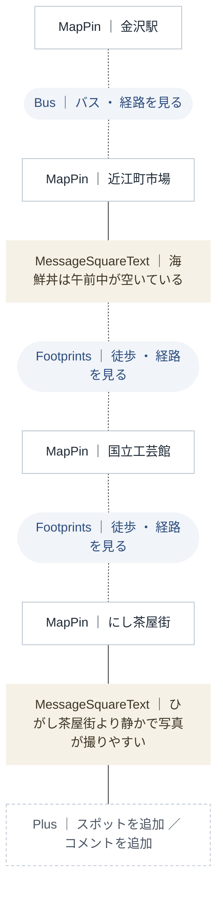
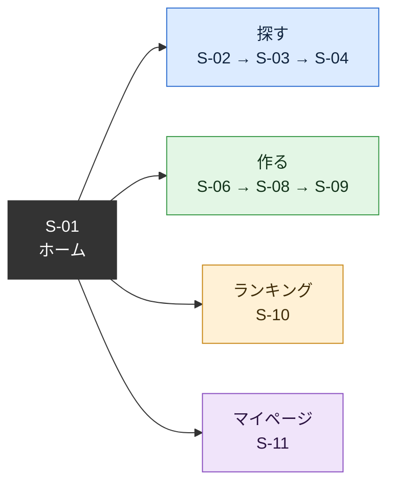
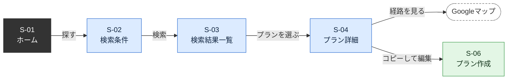
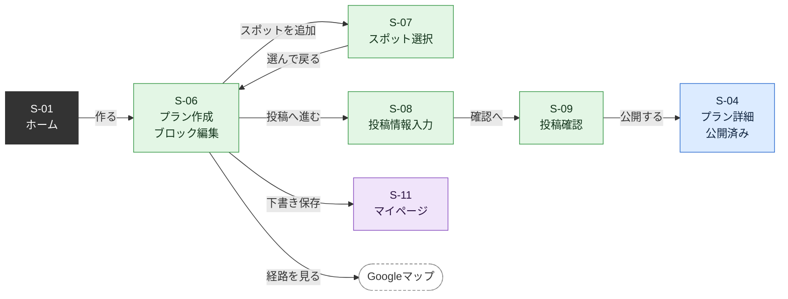
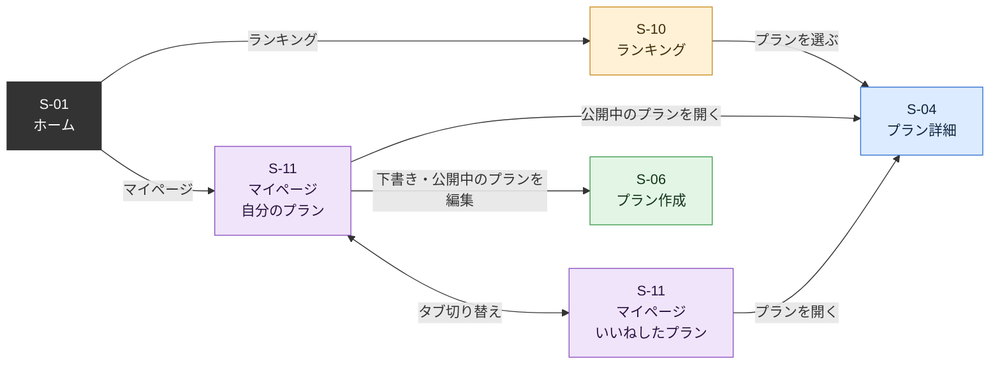

# 機能要件_画面遷移_MVP

# 旅ノートサイト MVP 機能要件・画面遷移

チーム CCCA305A-1 / プロジェクトテーマ：金沢らしさを観光客に広めるには

この文書はMVP（最小限の試作）の範囲だけをまとめたもの。全機能版は「機能要件_画面遷移.md」、技術的な詳細（データベース、API、URL、UIデザインルール）は「技術選定_API設計_v3.md」を参照。

## 0. 変更履歴

「技術選定_API設計_v3.md」での決定事項に合わせて修正した。

| 項目 | 変更内容 | 根拠（v3の確認事項） |
| --- | --- | --- |
| 利用後アンケート | F-33 を削除。効果検証は検証段階でGoogleフォームを別に作る | Q5、Q20 |
| マイページ | 「自分のプラン（公開中・下書き）」と「いいねしたプラン」の2タブにした | Q4 |
| 公開済みプラン | 編集と、非公開（下書き）に戻す操作を追加 | Q8 |
| 制限・条件 | ブロック30個まで、公開時のチェック条件、ランキングは全期間 | Q6、Q9、Q10 |
| 写真 | スポットブロックごとに1枚 | Q7 |
| ログイン | メールアドレスとパスワード。メールは送信しない | Q15、Q18 |
| 共通の操作 | 画面下部に固定のタブを置く方式に変更 | v3 8章 |
| ブロックのイメージ図 | 絵文字を削除し、v3のUIデザインルール（9章）に合わせた見た目にした | v3 9章 |

## 1. MVPの範囲

他の観光客が投稿した旅行プランを検索・閲覧し、それをもとに自分の旅行プランをブロックで組み立てて作成・投稿できるサイト。スマホで使うことを前提にする。

MVPで確かめたいこと

- タグ検索で、定番以外のスポットを含むプランに出会えるか
- ブロックを並べる操作で、旅行プランを迷わず組み立てられるか
- 使った人が「金沢らしさを知れた」と感じるか（サイトの外のGoogleフォームで確認する）

設計方針

- プランは3種類のブロック（スポット、移動手段、コメント）を並べて作る。見る画面と作る画面で同じブロックの見た目を使う
- 経路の詳細は自前で持たず、GoogleマップのURLを自動生成して任せる
- 閲覧と検索はログインなしで使える。保存、投稿、いいねにはログインが必要
- 検索は固定タグの一致で行う
- 絵文字は使わず、アイコンは Lucide に統一する。左線のアクセントカードは使わない

## 2. MVP機能要件

機能IDは全機能版と共通。

### 2.1 旅行プラン検索・閲覧

| ID | 機能 | 内容 |
| --- | --- | --- |
| F-01 | キーワード検索 | 固定タグ（食事、景観、歴史、写真、ゆったり、時短、コスパ、くつろぎ、晴れ、雨、曇り）を複数選択して検索する |
| F-03 | 検索結果一覧 | 選んだタグのどれか1つでも一致したプランをカード形式で表示する。一致したタグ数が多い順に並べる |
| F-04 | 定番以外の優先表示 | 一致数が同じなら、定番以外のスポットを含むプランを上位に出す |
| F-05 | プラン詳細の閲覧 | スポット、移動手段、コメントをブロック形式で表示する |
| F-07 | Googleマップで経路を開く | 移動手段ブロックごとに、その区間の経路URLを自動生成してGoogleマップを開く |

### 2.2 旅行プラン作成・投稿

| ID | 機能 | 内容 |
| --- | --- | --- |
| F-11 | ブロックでプランを組み立てる | スポット、移動手段、コメントの3種類のブロックを縦に並べてプランを作る。1プラン30ブロックまで |
| F-12 | スポットブロックの追加 | 開発側で登録したスポット一覧から選んで追加する（自由入力にしない） |
| F-13 | ブロックの並べ替え・削除 | 長押ししてドラッグ、または上下ボタンで順番を入れ替える。不要なブロックを削除する |
| F-14 | 移動手段ブロック | スポットとスポットの間に自動で入る。移動手段（徒歩、バス、自転車、車）を選ぶ。初期値は徒歩 |
| F-15 | コメントブロック | 好きな位置に追加できる自由記述のブロック（500文字まで）。感想、おすすめ、注意点、食事や休憩の予定などを書く |
| F-16 | 他のプランをコピーして編集 | プラン詳細から1タップで作成画面に取り込み、自分用に編集する。保存時に「〇〇さんのプランをもとに作成」と記録される |
| F-17 | 下書き保存 | 作成途中のプランを非公開のまま保存する |
| F-18 | 投稿情報の入力 | タイトル（50文字まで）、タグ、スポットブロックごとの写真（1枚まで、任意）を入力する |
| F-19 | 投稿 | 内容を確認して公開する。公開時に、タイトルあり、スポット2つ以上、タグ1つ以上を確認する |

### 2.3 旅行プランランキング

| ID | 機能 | 内容 |
| --- | --- | --- |
| F-21 | 総合ランキング | 全期間のいいね数の多い順にプランを表示する |
| F-22 | 定番以外ランキング | 定番以外のスポットを含むプランだけのランキング |
| F-24 | いいね | プラン詳細からいいねを付ける・取り消す。ランキングの指標になり、マイページから見返せる |

### 2.4 共通

| ID | 機能 | 内容 |
| --- | --- | --- |
| F-31 | ユーザー登録・ログイン | メールアドレス、パスワード（8文字以上）、表示名で登録する。メールは送信しない。パスワードを忘れた場合はチームに連絡してもらい、管理者が再設定する |
| F-32 | マイページ | 「自分のプラン」タブで自分が作ったプラン（公開中・下書き）を見る・編集する・非公開に戻す・削除する。「いいねしたプラン」タブでいいねしたプランを見返す |

### 2.5 MVPから外した機能

| ID | 機能 | 外した理由 |
| --- | --- | --- |
| F-02 | フリーワード検索 | タグ検索だけで検証できる |
| F-06 | スポット詳細の閲覧 | プラン詳細のブロックにスポット名が出れば足りる |
| F-23 | カテゴリ別ランキング | 総合と定番以外の2つで検証できる |
| F-33 | 利用後アンケート | サイトには入れず、検証段階でGoogleフォームを別に作る |
| — | メモブロック | コメントブロック（F-15）に統合した |
| — | ブックマーク | 「いいねしたプラン」で見返せるため作らない |

## 3. ブロックの仕様

| ブロック | アイコン | 追加のしかた | 入力するもの | 並べ替え | 削除 |
| --- | --- | --- | --- | --- | --- |
| スポット | MapPin | 「スポットを追加」からスポット一覧で選ぶ | 写真1枚（任意） | できる | できる |
| 移動手段 | Footprints、Bus、Bike、Car | スポットとスポットの間に自動で入る | 移動手段を1つ選ぶ | できない（スポットに連動） | できない（スポットに連動） |
| コメント | MessageSquareText | 「コメントを追加」で好きな位置に入れる | 自由記述の文章 | できる | できる |
- スポットを並べ替えると、間の移動手段ブロックは自動で付け直される
- 間にコメントがある場合、移動手段ブロックは次のスポットの直前に表示する
- 移動手段ブロックには「経路を見る」（Navigation アイコン）があり、前後のスポットと選んだ移動手段からGoogleマップのURLを生成する

見た目（v3 9.4）

- スポット：四辺に細い枠線がある白いカード。左上にアイコンのバッジとスポット名
- 移動手段：カードにしない。前後のカードの間に縦の点線と、移動手段のアイコンと名前が入った小さな丸いラベル
- コメント：枠線のない、背景が薄い色のカード

図の「MapPin」などは、実際の画面では Lucide のアイコンとして表示される。白い四角がスポット、丸いラベルが移動手段（点線でつながる）、薄い色の四角がコメント。

## 4. 画面一覧

| 画面ID | 画面名 | 主な内容 | 対応機能 |
| --- | --- | --- | --- |
| S-01 | ホーム | 検索、作成、ランキング、マイページへの入口 | — |
| S-02 | 検索条件 | タグ選択 | F-01 |
| S-03 | 検索結果一覧 | プランのカード一覧 | F-03, F-04 |
| S-04 | プラン詳細 | ブロック形式のプラン、経路を見る、いいね、コピーして編集。自分のプランなら編集・非公開に戻す | F-05, F-07, F-16, F-24, F-32 |
| S-06 | プラン作成（ブロック編集） | ブロックの追加、並べ替え、削除、移動手段の選択、コメント入力 | F-11, F-13, F-14, F-15, F-17 |
| S-07 | スポット選択 | スポット一覧から追加するスポットを選ぶ。S-06 の上に重ねて表示 | F-12 |
| S-08 | 投稿情報入力 | タイトル、タグ、スポットごとの写真 | F-18 |
| S-09 | 投稿確認 | 内容確認、公開時のチェック、公開 | F-19 |
| S-10 | ランキング | 総合、定番以外の切り替え | F-21, F-22 |
| S-11 | マイページ | 「自分のプラン」「いいねしたプラン」の2タブ | F-24, F-32 |
| S-12 | ログイン・登録 | ログイン、新規登録、パスワードを忘れた場合の案内 | F-31 |
| 外部 | Googleマップ | 経路の表示 | F-07 |

S-05（スポット詳細）はMVPでは作らないため欠番。各画面のURLは「技術選定_API設計_v3.md」の7章を参照。

## 5. 画面遷移図

見やすさのため、全体の地図と、目的別の流れに分けている。

### 5.1 全体の地図

画面下部の固定タブから、4つの入口にいつでも移れる。それぞれの中身は5.2以降で示す。

### 5.2 プランを探す

### 5.3 プランを作って投稿する

- コメントブロックの追加、ブロックの並べ替えと削除、移動手段の選択は、S-06の画面内で完結するため遷移はない
- 「投稿へ進む」の時点で一度下書きとして保存する。途中で閉じても内容が残る
- S-09 で公開時のチェック（タイトル、スポット2つ以上、タグ1つ以上）に引っかかった場合は、S-08 または S-06 に戻って直す

### 5.4 ランキングとマイページ

非公開に戻す、削除、いいねの取り消しは、S-11 と S-04 の画面内の操作のため遷移はない。

### 5.5 ログインが必要になる場面

未ログインで次の操作をすると S-12（ログイン・登録）に移り、ログイン後は元の画面に戻って操作を続ける。作成中のプランは、ログイン画面に移る前にブラウザに一時保存し、戻ったときに復元する。

| 画面 | 操作 |
| --- | --- |
| S-04 プラン詳細 | いいね |
| S-06 プラン作成 | 下書き保存、投稿へ進む |
| S-11 マイページ | 画面を開く |

コピーして編集すること自体はログインなしでできる。保存するときにログインを求める。

### 5.6 共通の操作

- 画面下部に固定のタブを置き、どの画面からでも「ホーム」「探す」「作る」「ランキング」「マイページ」に移れる
- 画面上部の戻るボタン（ArrowLeft）で1つ前の画面に戻れる（S-03 から S-02、S-09 から S-08 など）

## 6. 未決事項

「技術選定_API設計_v3.md」の11章で管理している。MVPの機能に関わるものは次のとおり。

- スポット一覧に登録するスポット（Q11）
- 定番スポットとして扱うスポット（Q12）
- サイトのテーマカラーと名前（Q21、Q22）
- Googleマップの経路URLと、ブロックのドラッグ操作のスマホでの動作確認（T1〜T3）